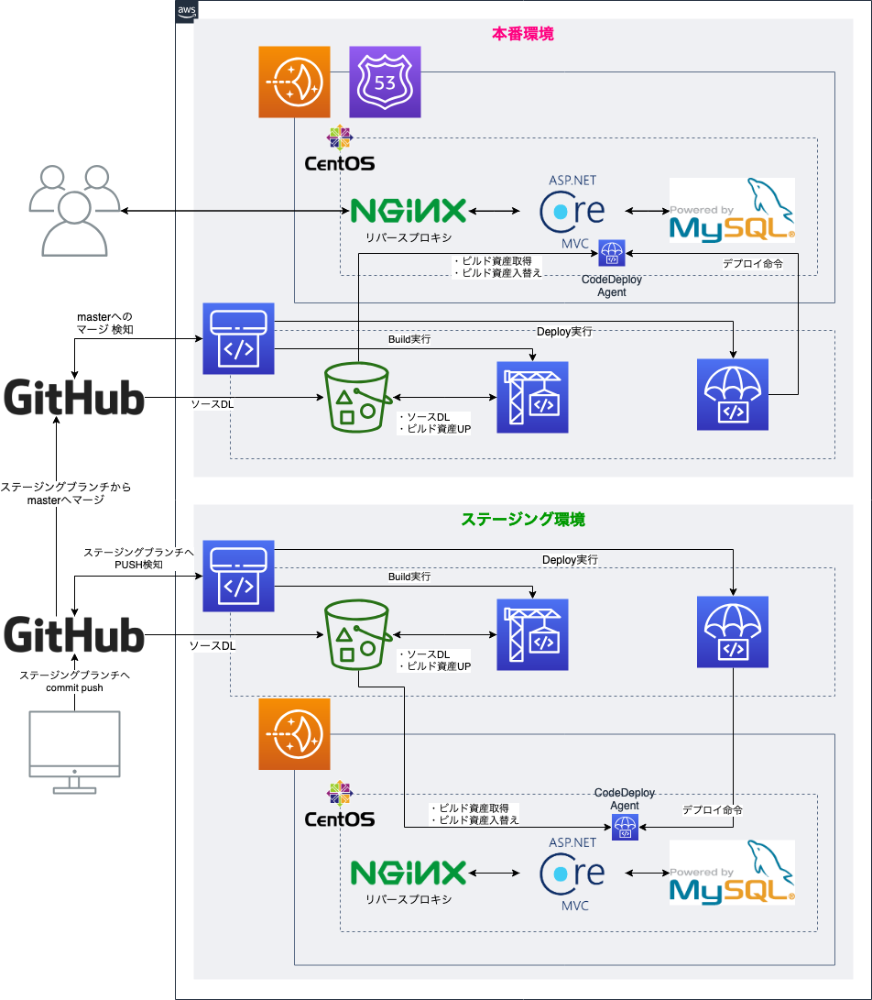

# What's this...

やらないと行けないけど中々やる気にならない身近なことを周りに宣言して実行することをコンセプトにしています。  
3分間でできそうなことだけどやる気を出さないとやらないことをタスクとしてつぶやいて結果もツイートします。  

Twitter主体の生活をしている私ならではのTwitterを主体としたTodoアプリです。

# 使用イメージ

|||||
|-|-|-|-|
|<blockquote class="twitter-tweet" data-lang="ja"><p lang="ja" dir="ltr">┬[] 銀行へ行く<br>├[] 新幹線の切符買いに行く<br>├[] ブログ記事書く<br>└[] ブログ記事書き溜める<a href="https://twitter.com/hashtag/3%E5%88%86%E9%96%93%E6%9C%AC%E6%B0%97%E5%87%BA%E3%81%99?src=hash&amp;ref_src=twsrc%5Etfw">#3分間本気出す</a></p>&mdash; あとらす (@Lychee_jam) <a href="https://twitter.com/Lychee_jam/status/990091857798483968?ref_src=twsrc%5Etfw">2018年4月28日</a></blockquote>|<blockquote class="twitter-tweet" data-lang="ja"><p lang="ja" dir="ltr">┬[○] 銀行へ行く<br>├[○] 新幹線の切符買いに行く<br>├[] ブログ記事書く<br>└[] ブログ記事書き溜める<a href="https://twitter.com/hashtag/3%E5%88%86%E9%96%93%E6%9C%AC%E6%B0%97%E5%87%BA%E3%81%99?src=hash&amp;ref_src=twsrc%5Etfw">#3分間本気出す</a></p>&mdash; あとらす (@Lychee_jam) <a href="https://twitter.com/Lychee_jam/status/990116605307715584?ref_src=twsrc%5Etfw">2018年4月28日</a></blockquote>|<blockquote class="twitter-tweet" data-lang="ja"><p lang="ja" dir="ltr">┬[○] 銀行へ行く<br>├[○] 新幹線の切符買いに行く<br>├[○] ブログ記事書く<br>└[] ブログ記事書き溜める<a href="https://twitter.com/hashtag/3%E5%88%86%E9%96%93%E6%9C%AC%E6%B0%97%E5%87%BA%E3%81%99?src=hash&amp;ref_src=twsrc%5Etfw">#3分間本気出す</a></p>&mdash; あとらす (@Lychee_jam) <a href="https://twitter.com/Lychee_jam/status/990150908083253248?ref_src=twsrc%5Etfw">2018年4月28日</a></blockquote>|<blockquote class="twitter-tweet" data-lang="ja"><p lang="ja" dir="ltr">┬[○] 銀行へ行く<br>├[○] 新幹線の切符買いに行く<br>├[○] ブログ記事書く<br>└[×] ブログ記事書き溜める<a href="https://twitter.com/hashtag/3%E5%88%86%E9%96%93%E6%9C%AC%E6%B0%97%E5%87%BA%E3%81%99?src=hash&amp;ref_src=twsrc%5Etfw">#3分間本気出す</a></p>&mdash; あとらす (@Lychee_jam) <a href="https://twitter.com/Lychee_jam/status/990269326321074176?ref_src=twsrc%5Etfw">2018年4月28日</a></blockquote>|

上記のような形でTodoを管理することができます。

Todoの管理ステータスを顔文字に変更しました。

|||
|-|-|
|<blockquote class="twitter-tweet" data-lang="ja"><p lang="ja" dir="ltr">─[ ] 早起きする<a href="https://twitter.com/hashtag/3%E5%88%86%E9%96%93%E6%9C%AC%E6%B0%97%E5%87%BA%E3%81%99?src=hash&amp;ref_src=twsrc%5Etfw">#3分間本気出す</a></p>&mdash; あとらす (@Lychee_jam) <a href="https://twitter.com/Lychee_jam/status/1104055886798970880?ref_src=twsrc%5Etfw">2019年3月8日</a></blockquote>|<blockquote class="twitter-tweet" data-lang="ja"><p lang="ja" dir="ltr">─[🙃] 早起きする<a href="https://twitter.com/hashtag/3%E5%88%86%E9%96%93%E6%9C%AC%E6%B0%97%E5%87%BA%E3%81%99?src=hash&amp;ref_src=twsrc%5Etfw">#3分間本気出す</a></p>&mdash; あとらす (@Lychee_jam) <a href="https://twitter.com/Lychee_jam/status/1104235454168162304?ref_src=twsrc%5Etfw">2019年3月9日</a></blockquote>|

# 開発環境

## OS X

* Visual Studio for Mac or Visual Studio Code
* .NET Core 2.2 SDK
  * Template: ASP.NET Core MVC add Individual authentication
  ```sh
  $ dotnet new mvc -n hoge -au Individual
  ```
* Packages
  * CoreTweet Version:1.0.0.483
  * Pomelo.EntityFrameworkCore.MySql Version:2.2.0

## Windows

* VisualStudio 2017 Com

# インフラ構成
* AWS Lightsail $5プラン
  * 1CPU、Mem 1G
* Nginxでリバースプロキシ
* DB MySQL 5.7
* AWS CodePipelineで自動ビルド・デプロイ環境構築済み
  * 構成：GitHub + CodeBuild + CodeDeploy



# 関連ブログ記事
このプロジェクトに関連するブログ記事です。

* [dotnet cliのMVCテンプレートの認証オプション - あとらすの備忘録](http://kitigai.hatenablog.com/entry/2019/02/26/223534)
* [ASP.NET Core IdentityでTwitter認証をするとAn unhandled exception occurred while processing the requestが発生する - あとらすの備忘録](http://kitigai.hatenablog.com/entry/2019/02/27/003134)
* [Mac環境のASP.NET Core MVCでdocker上のMySQLを使用する - あとらすの備忘録](http://kitigai.hatenablog.com/entry/2019/03/01/005640)
* [ASP.NET CoreからMySQLへCRUDするとNo coercion operator is defined between types 'System.Int16' and 'System.Boolean'エラーが発生する - あとらすの備忘録](http://kitigai.hatenablog.com/entry/2019/03/01/030000)
* [.NET Core EFとMySQLでDuplicate entry '0' for key 'PRIMARY'エラーが発生 - あとらすの備忘録](http://kitigai.hatenablog.com/entry/2019/03/03/015358)
* [.NET Core EFとMySQLでField 'Id' doesn't have a default valueエラーが発生 - あとらすの備忘録](http://kitigai.hatenablog.com/entry/2019/03/03/025337)
* [Dockerで稼働するMySQLの文字コードを設定する話 - あとらすの備忘録](http://kitigai.hatenablog.com/entry/2019/03/03/203310)
* [EntityFramework CoreでDBの状態を過去のマイグレーションに戻す。 - あとらすの備忘録](http://kitigai.hatenablog.com/entry/2019/03/05/163622)
* [ASP\.NET CoreでAPIキーなどの秘匿情報をsecret.jsonを使用して秘匿する - あとらすの備忘録](http://kitigai.hatenablog.com/entry/2019/03/05/190813)
* [ASP\.NET Core MVCアプリをAWS Lightsail（CentOS 7）で公開する。 - あとらすの備忘録](http://kitigai.hatenablog.com/entry/2019/03/16/182112)
* [AWS Lightsail（CentOS 7）にMySQL 5.7の構築 - あとらすの備忘録](http://kitigai.hatenablog.com/entry/2019/03/16/195149)
* [ASP\.NET CoreアプリをCentOSでサービス登録し自動起動を設定する - あとらすの備忘録](http://kitigai.hatenablog.com/entry/2019/03/16/202454)
* [CodeDeployを使用したデプロイがタイムアウトとなり失敗する - あとらすの備忘録](http://kitigai.hatenablog.com/entry/2019/03/16/230208)

# 関連プロジェクト

本プロジェクトは下記のプロジェクトと関連しています。

* 
* 
* 

# License
